# Business Requirements Document (BRD) and Technical Specifications for AI-Based Code Analyzer and Modernization Application

*Generated on August 06, 2025, at 10:47 PM EDT*

---

## 1. Business Requirements Document (BRD)

### 1.1 Business Objectives
- **Primary Goal**: Develop an AI-powered code analysis and modernization platform leveraging an agentic architecture with Multi-Agent Constraint Programming (MCP) to enhance developer productivity, improve code quality, and accelerate legacy code modernization.
- **Key Objectives**:
  - Enable seamless ingestion and analysis of code from multiple version control systems (VCS) such as GitHub, GitLab, and Bitbucket using autonomous agents.
  - Provide AI-driven modernization recommendations (e.g., refactoring suggestions, migration to modern frameworks) through specialized agents.
  - Ensure scalability, security, and extensibility via MCP to handle diverse codebases, from small projects to enterprise-scale repositories.
  - Automate metadata extraction and analysis with constraint-based coordination to reduce manual effort.
  - Facilitate real-time integration with development workflows through event-driven agents and webhook processing.

### 1.2 Scope
- **In-Scope**:
  - Code ingestion from GitHub, GitLab, Bitbucket, with a pluggable architecture for additional VCS platforms.
  - Support for major programming languages (e.g., Python, Java, JavaScript/TypeScript, C++) in MVP, with extensible parsers.
  - Metadata extraction (e.g., ASTs, dependency graphs, code metrics) using agent-based workflows.
  - Incremental ingestion via webhooks with MCP-driven prioritization.
  - Secure handling of credentials and sensitive data with agent-based compliance enforcement.
  - Scalable, fault-tolerant architecture using MCP to optimize resource allocation.
  - RESTful APIs and webhook interfaces for external system integration.
  - Phased development plan with clear MVP and future enhancements.
- **Out-of-Scope (MVP)**:
  - Real-time code editing or IDE integration.
  - Advanced AI model training or customization by end-users.
  - Support for niche or legacy VCS platforms.

### 1.3 Non-Functional Requirements
- **Performance**:
  - Process repositories up to 1 million lines of code within 10 minutes for initial ingestion (MVP target).
  - Handle incremental updates within 30 seconds for high-priority changes (e.g., critical files).
  - Support 100+ concurrent ingestion jobs with MCP-optimized task allocation.
- **Scalability**:
  - Horizontal scaling of agent workers with MCP to balance resource constraints.
  - Distributed storage for metadata and raw code, optimized for query performance.
- **Security**:
  - OAuth 2.0 for VCS authentication, with AES-256 encryption for tokens at rest.
  - Role-based access control (RBAC) for API endpoints.
  - Compliance with GDPR and CCPA via agent-based monitoring and redaction.
  - Audit logging for all ingestion, access, and constraint violation events.
- **Extensibility**:
  - Pluggable parser framework for new languages via modular agent plugins.
  - Configurable VCS connectors for future platforms.
- **Reliability**:
  - 99.9% uptime for ingestion service.
  - Fault-tolerant design with automatic retries and graceful degradation, enforced by MCP constraints.
- **Usability**:
  - Clear API documentation with OpenAPI specifications.
  - Webhook-based notifications and feedback endpoints for seamless CI/CD integration.
  - Constraint satisfaction rate: 100% for hard constraints, 95% for soft constraints.

---

## 2. Data Schema

The schema is optimized for storage, scalability, and AI consumption, with updates to support MCP constraints, feedback, and AI results. Large data fields (e.g., raw code) are stored separately.

### 2.1 Core Entities

#### Repository
```json
{
  "repository_id": "UUID",
  "name": "string",
  "vcs_provider": "string",
  "vcs_url": "string",
  "owner_id": "UUID",
  "last_ingested": "timestamp",
  "status": "enum(pending, processing, completed, failed)",
  "created_at": "timestamp",
  "updated_at": "timestamp"
}
```
#### File
```json
{
  "file_id": "UUID",
  "repository_id": "UUID",
  "path": "string",
  "language": "string",
  "hash": "string",
  "last_modified": "timestamp",
  "metadata_id": "UUID",
  "raw_content_ref": "string"
}
```

#### Metadata
```json
{
  "metadata_id": "UUID",
  "file_id": "UUID",
  "ast": "json",
  "dependencies": ["string"],
  "metrics": {
    "lines_of_code": "integer",
    "cyclomatic_complexity": "integer",
    "comment_ratio": "float"
  },
  "created_at": "timestamp"
}
```

#### IngerstionJob
```json
{
  "job_id": "UUID",
  "repository_id": "UUID",
  "type": "enum(full, incremental)",
  "status": "enum(pending, running, completed, failed)",
  "progress": {
    "total_files": "integer",
    "processed_files": "integer",
    "percentage": "float"
  },
  "constraints_satisfied": "boolean",
  "constraint_violations": ["string"],
  "error_message": "string | null",
  "started_at": "timestamp",
  "completed_at": "timestamp | null"
}
```

#### Constraints
```json
{
  "constraint_id": "UUID",
  "job_id": "UUID",
  "type": "enum(resource, temporal, dependency, security)",
  "details": {
    "resource_limit"?: { "cpu": "integer", "memory": "string" },
    "deadline"?: "timestamp",
    "dependency"?: "string",
    "security_rule"?: "string"
  },
  "priority": "enum(high, medium, low)"
}
```

#### AIResult
```json
{
  "ai_result_id": "UUID",
  "metadata_id": "UUID",
  "type": "enum(code_smell, refactoring, metric)",
  "details": "json",
  "confidence": "float",
  "constraints_satisfied": "boolean",
  "constraint_violations": ["string"]
}
```

#### FeedBack
```json
{
  "feedback_id": "UUID",
  "result_id": "UUID",
  "rating": "enum(positive, negative)",
  "comment": "string",
  "constraints": {
    "urgency": "enum(low, medium, high)",
    "impact": "integer"
  },
  "timestamp": "timestamp"
}
```

#### AuditLog
```json
{
  "event_id": "UUID",
  "type": "enum(api_access, webhook, job_failure)",
  "timestamp": "timestamp",
  "user_id": "UUID",
  "details": "string",
  "compliance_status": "enum(compliant, non_compliant)",
  "constraint_violations": ["string"]
}
```

### 2.2 Storage Strategy

- **Database:** PostgreSQL for structured data (Repository, File, IngestionJob, Constraints, Feedback, AuditLog) with indexing on repository_id, file_id, hash, and constraint_id.
- Metadata Storage: MongoDB for ASTs, AI results, and large metadata fields.
- Raw Code Storage: AWS S3 or Google Cloud Storage for raw code files.
Incremental Updates: Use file hashes to detect changes, with a changelog table:

```json
{
  "change_id": "UUID",
  "file_id": "UUID",
  "job_id": "UUID",
  "action": "enum(created, updated, deleted)",
  "timestamp": "timestamp"
}
```

## 3. Key Interfaces
Interfaces are defined in TypeScript-like syntax, updated to support MCP constraints and feedback.

### 3.1 Ingestion Service API

 ***POST /ingestion/jobs***
Initiate a new ingestion job with constraints.

```typescript
interface CreateIngestionJobRequest {
  repository_id: string;
  vcs_provider: "github" | "gitlab" | "bitbucket";
  type: "full" | "incremental";
  auth_token: string;
  constraints?: {
    deadline?: string;
    max_concurrent_tasks?: number;
    priority_files?: string[];
  };
}
interface CreateIngestionJobResponse {
  job_id: string;
  status: "pending" | "running" | "completed" | "failed";
  created_at: string;
}
```

***GET /ingestion/jobs/:job_id***
Check job status with constraint details.
```typescript
interface JobStatusResponse {
  job_id: string;
  repository_id: string;
  type: "full" | "incremental";
  status: "pending" | "running" | "completed" | "failed";
  progress: {
    total_files: number;
    processed_files: number;
    percentage: number;
  };
  constraints_satisfied: boolean;
  constraint_violations?: string[];
  error_message?: string;
  started_at: string;
  completed_at?: string;
}
```

***POST /webhooks/:vcs_provider***

```typescript
interface WebhookRequest {
  event_type: "push" | "commit" | "merge";
  repository_id: string;
  changes: {
    file_path: string;
    action: "added" | "modified" | "deleted";
    commit_id: string;
  }[];
  vcs_signature: string;
  constraints: {
    priority: "low" | "medium" | "high";
    deadline?: string;
  };
}
interface WebhookResponse {
  status: "received";
  job_id?: string;
}
```

***POST /ingestion/callback***
Notify external services upon job completion.
```typescript
interface CallbackRequest {
  job_id: string;
  repository_id: string;
  status: "completed" | "failed";
  metadata_summary: {
    total_files: number;
    languages: string[];
    errors: string[];
    constraints_satisfied: boolean;
  };
}
interface CallbackResponse {
  status: "acknowledged";
}
```


***POST /feedback***
Collect user feedback with constraints.
```typescript
interface FeedbackRequest {
  result_id: string;
  rating: "positive" | "negative";
  comment?: string;
  constraints?: {
    urgency: "low" | "medium" | "high";
    impact: number;
  };
}
interface FeedbackResponse {
  status: "recorded";
}
```

### 3.2 Security Considerations

- API endpoints use API keys or OAuth tokens.
- Webhook requests validated with HMAC signatures.
- Sensitive data encrypted with AES-256.
- Rate limiting: 100 requests/minute per user.
- MCP enforces security constraints (e.g., redaction, compliance).


## 4. Phased Development Plan

### 4.1 Phase 1: Minimum Viable Product (MVP)

***Features:***

- Agents: MCPOrchestratorAgent, VCSConnectorAgent (GitHub, GitLab), ParserAgent (Python, JavaScript/TypeScript), MetadataExtractorAgent, StorageAgent, SecurityMonitorAgent, ComplianceAgent, APIServer.
- Basic MCP for resource and temporal constraints.
- REST API for ingestion and status checks.
- Webhook support for GitHub.
- PostgreSQL, MongoDB, S3 storage.
- Basic security (OAuth 2.0, encryption).


***Success Criteria:***

- Ingest 100K-line repository in <15 minutes.
- Process incremental updates for 1,000-file repositories.
- 99% accuracy in language detection and AST generation.
- 100% webhook event processing without data loss.
- 100% constraint satisfaction for hard constraints.


Timeline: 3-4 months.

### 4.2 Phase 2: Enhanced Features

***Features:***

- Add Bitbucket support to VCSConnectorAgent.
- Introduce WebhookProcessorAgent, PrioritySchedulerAgent, FeedbackAgent.
- Advanced MCP for task prioritization and dependency analysis.
- Callback mechanism for job completion.
- Horizontal scaling with Kubernetes.
- Audit logging with compliance checks.


***Success Criteria:***

- Ingest 1M-line repository in <10 minutes.
- Support 50 concurrent jobs with MCP optimization.
- 99.9% uptime.
- Comprehensive audit logs for 100% of events.
- 95% constraint satisfaction for soft constraints.


Timeline: 5-6 months post-MVP.

### 4.3 Phase 3: Advanced AI Integration

***Features:***

- Add CodeSmellAgent, RefactoringAgent, MetricsAgent.
- AI-driven MCP for task prioritization (e.g., reinforcement learning).
- CI/CD pipeline integration.
- Advanced metrics (e.g., maintainability index).
- Custom webhook configurations.


***Success Criteria:***

- Generate actionable refactoring suggestions for 90% of codebases.
- Support 100+ concurrent jobs.
- Extend parser support to Java, C++ with 95% accuracy.
- Seamless CI/CD integration with zero downtime.


Timeline: 6-8 months post-Phase 2.

### 4.4 Phase 4: Enterprise Scale and Extensibility

***Features:***

- Multi-tenant architecture with MultiTenantManager.
- On-premises deployment with OnPremDeployer.
- Analytics dashboard with constraint-driven visualizations.
- Extensible VCS connector framework.
- SOC 2 and ISO 27001 compliance.


***Success Criteria:***

- Support 1,000 concurrent enterprise users.
- Deploy on-premises for 1 client with zero issues.
- Achieve SOC 2 compliance.
- Add 1 niche VCS platform.


Timeline: 8-12 months post-Phase 3.

## 5. Component Diagram
The following diagram groups agents by functional domain, with MCP-driven coordination.

```mermaid
classDiagram
    subgraph Ingestion
        MCPOrchestratorAgent
        VCSConnectorAgent
        WorkloadPartitionerAgent
        WebhookProcessorAgent
        PrioritySchedulerAgent
    end
    subgraph Analysis
        ParserAgent
        MetadataExtractorAgent
        CodeSmellAgent
        RefactoringAgent
        MetricsAgent
    end
    subgraph Storage
        StorageAgent
    end
    subgraph Security
        SecurityMonitorAgent
        ComplianceAgent
    end
    subgraph UserInteraction
        FeedbackAgent
        APIServer
    end

    class MCPOrchestratorAgent {
        +solveConstraints()
        +coordinateAgents()
    }
    class VCSConnectorAgent {
        +fetchCode()
        +publishCodeFetched()
    }
    class WorkloadPartitionerAgent {
        +splitJobs()
        +assignTasks()
    }
    class WebhookProcessorAgent {
        +validateWebhook()
        +enqueueEvent()
    }
    class PrioritySchedulerAgent {
        +prioritizeTasks()
        +applyConstraints()
    }
    class ParserAgent {
        +parseCode()
        +generateAST()
    }
    class MetadataExtractorAgent {
        +extractMetadata()
        +computeMetrics()
    }
    class CodeSmellAgent {
        +detectCodeSmells()
    }
    class RefactoringAgent {
        +suggestRefactorings()
    }
    class MetricsAgent {
        +computeMetrics()
    }
    class StorageAgent {
        +storeData()
        +redactSensitiveData()
    }
    class SecurityMonitorAgent {
        +detectAnomalies()
    }
    class ComplianceAgent {
        +enforceCompliance()
    }
    class FeedbackAgent {
        +collectFeedback()
        +triggerImprovements()
    }
    class APIServer {
        +exposeRESTEndpoints()
    }

    MCPOrchestratorAgent --> VCSConnectorAgent : Coordinates
    MCPOrchestratorAgent --> ParserAgent : Coordinates
    MCPOrchestratorAgent --> MetadataExtractorAgent : Coordinates
    MCPOrchestratorAgent --> StorageAgent : Coordinates
    MCPOrchestratorAgent --> WorkloadPartitionerAgent : Uses
    MCPOrchestratorAgent --> PrioritySchedulerAgent : Uses
    MCPOrchestratorAgent --> SecurityMonitorAgent : Monitors
    MCPOrchestratorAgent --> ComplianceAgent : Enforces
    MCPOrchestratorAgent --> CodeSmellAgent : Integrates (Phase 3)
    MCPOrchestratorAgent --> RefactoringAgent : Integrates (Phase 3)
    MCPOrchestratorAgent --> MetricsAgent : Integrates (Phase 3)
    MCPOrchestratorAgent --> FeedbackAgent : Collects (Phase 2)
    VCSConnectorAgent --> GitHub : Connects
    VCSConnectorAgent --> GitLab : Connects
    VCSConnectorAgent --> Bitbucket : Connects (Phase 2)
    WebhookProcessorAgent --> VCSConnectorAgent : Triggers
    StorageAgent --> PostgreSQL : Stores
    StorageAgent --> MongoDB : Stores
    StorageAgent --> S3 : Stores
    APIServer --> MCPOrchestratorAgent : Routes requests
    WebhookProcessorAgent --> APIServer : Receives via

    note for CodeSmellAgent "Phase 3"
    note for RefactoringAgent "Phase 3"
    note for MetricsAgent "Phase 3"
    note for FeedbackAgent "Phase 2"
    note for Bitbucket "Phase 2"
```



## 6. Flow Diagram
The following diagram illustrates the MCP-driven workflow.

