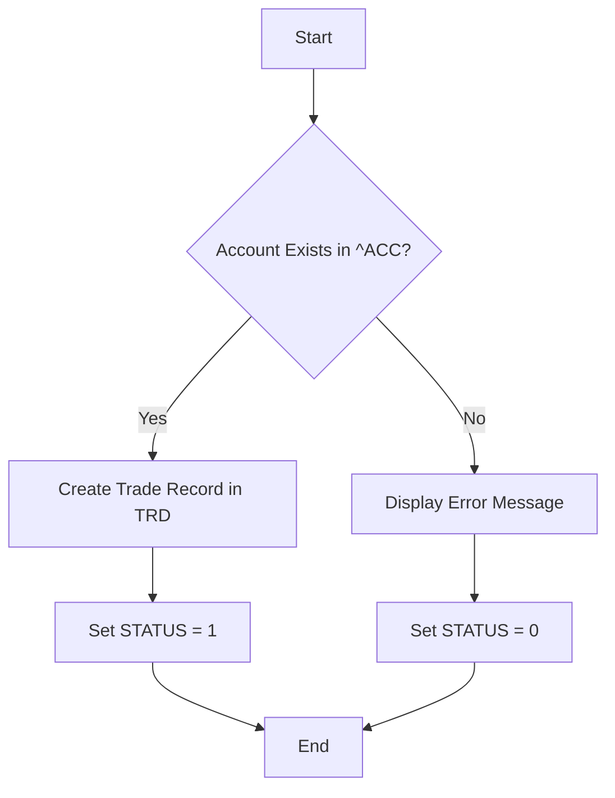

# Code Analysis Report: data/input/TradeCreate.m

## Overview
The file &#39;TradeCreate.m&#39; contains a MUMPS subroutine named `CREATE` that is responsible for creating trade records in a global array (`^TRD`). It takes trade details as input, checks for account existence, and stores the trade information if the account is valid. It also sets a status flag to indicate success or failure.

## Main Outline
- Account Existence Check: Verifies if the provided account exists in the `^ACC` global array.
- Trade Record Creation: If the account exists, creates a new trade record in the `^TRD` global array, storing trade details.
- Status Update: Sets the status variable to 1 for success or 0 for failure.

## Process Flow

## Business Logic
The core business logic involves validating the existence of an account before creating a trade record associated with that account. The trade record is stored in a global array using a concatenated string format.

## Technical Debt & Improvements
The code suffers from several areas of technical debt, including a lack of input validation, basic error handling, no concurrency control, direct global access, and a lack of transactionality and logging. The use of string concatenation for storing trade details is also a maintainability concern.

## Potential Vulnerabilities & Security
Potential security vulnerabilities exist due to the lack of input sanitization, which could lead to injection attacks if the input parameters are derived from user input.

## Recommendations
Implement input validation for all input parameters. Enhance error handling with more detailed error messages and logging. Implement concurrency control mechanisms to prevent data corruption in a multi-user environment. Sanitize input to prevent injection vulnerabilities. Implement transactionality to ensure data consistency. Consider refactoring the code to use a more structured approach for storing trade details, such as separate nodes for each field. Use an abstraction layer for global access to improve maintainability.

---
*Analysis generated by LLM-Powered Code Analyzer.*